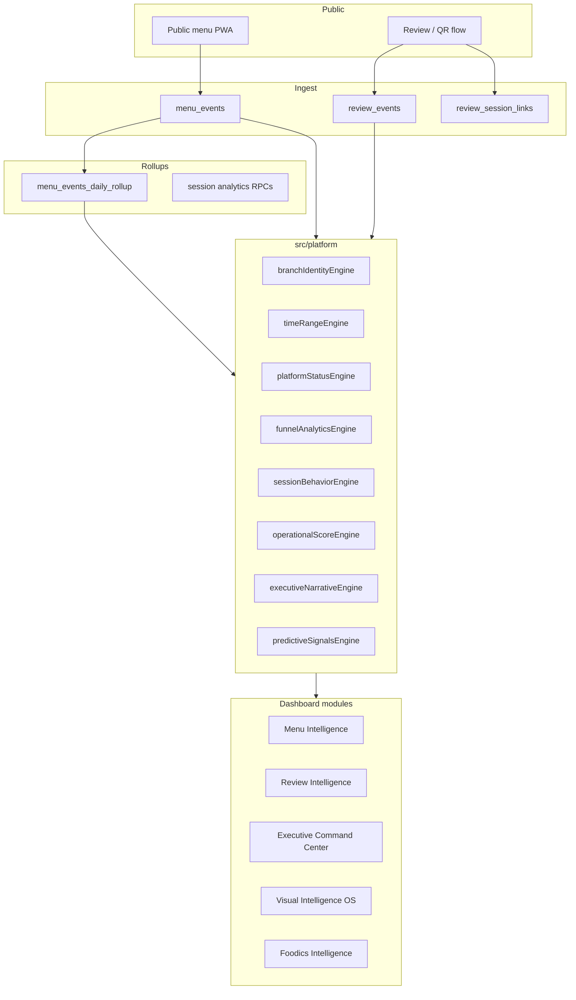

# NAC OS — Intelligence Platform Architecture

NAC OS is the restaurant intelligence layer on top of the public menu and review experiences. This document describes how data flows from guest events to executive dashboards, and where shared platform logic lives.

---

## System overview



---

## Event pipeline

### Menu events

| Stage | Detail |
|-------|--------|
| Capture | `menu_events` via anon client (`supabaseMenuTrack.js`) — impressions, opens, addons, time |
| Attribution | `branch_id`, `session_id`, item/category metadata |
| Query | `get_bi_dashboard` RPC or `menu_events` client fallback |
| Rollup | `menu_events_daily_rollup` + `refresh_menu_events_daily_rollup()` (service role / cron only) |

### Review events

| Stage | Detail |
|-------|--------|
| Capture | `review_events` — `qr_scan`, page opens, generate, Google redirect |
| Staff | `employee_name`, `employee_role`, normalized `branch_id` |
| Query | `get_review_events_summary` per branch or network |
| Staff merge | Per-branch RPC calls (`reviewStaffByBranch.js`) for correct attribution |

### Session linking

`review_session_links` connects review sessions to menu sessions where implemented. Session quality tiers are computed in `sessionQualityAggregate.js` and exposed via BI RPC or client patch.

---

## Intelligence layers

### Layer 0 — Contracts (`src/platform/contracts`)

- **`intelligenceRangeContract`** — Today (`today`), 7D (`7d`), Month (`month`) → `p_hours`, `sinceIso`, rollup flag
- **`platformStatusContract`** — `healthy`, `partial`, `live_fallback`, `baseline_building`, `sparse_history`, `stale_rollup`, `empty`

### Layer 1 — Platform engines (`src/platform/engines`)

| Engine | Responsibility |
|--------|----------------|
| `branchIdentityEngine` | `khobar` / `riyadh` / `jeddah` normalization; never null→Khobar for aggregates |
| `businessDayEngine` | 3:00 AM Asia/Riyadh business day |
| `timeRangeEngine` | Unified range contract for all modules |
| `funnelAnalyticsEngine` | Review tap→Google; menu funnel shells |
| `sessionBehaviorEngine` | Session quality tiers + BI mapping |
| `platformStatusEngine` | Executive-safe status + ops note partition |
| `operationalScoreEngine` | Branch review score 0–100 (not Foodics waiter score) |
| `executiveNarrativeEngine` | Terminology, deduped insights, confidence-aware KPIs |
| `predictiveSignalsEngine` | Demand/momentum/hidden-item signal stubs for future models |

**Import rule:** New intelligence code should import from `src/platform` (or re-exports), not duplicate formulas.

### Layer 2 — Fetch (`src/lib`)

- **`intelligenceQueryApi.js`** — `fetchBiDashboard`, `fetchReviewEventsSummary`, rollup routing, timeouts
- **`sessionAnalyticsApi.js`** — Session feed + aggregates
- **`menuEventsBiFallback.js`** — Client aggregation when RPC/rollup empty
- **`biDashboardNormalize.js`** — Stable BI payload shape

### Layer 3 — Domain engines (`src/dashboard/engines`)

Orchestration: predictive package, executive command center, exports, Foodics, competitive reputation. These **compose** platform engines; they should not reimplement branch or funnel math.

### Layer 4 — Views

Hooks: `useMenuBiDashboard`, `useReviewIntelligenceData`, `useExecutiveCommandCenter`, `usePredictiveIntelligence`.

UI status: `PlatformStatusBanner` (user copy) + `InternalOpsStatusPanel` (technical ops, collapsed).

---

## Time windows (Today / 7D / Month)

All intelligence modules should use:

```javascript
import { buildIntelligenceRangeContract } from "../platform/engines/timeRangeEngine";

const range = buildIntelligenceRangeContract(selectedRange);
// range.id, range.hours, range.sinceIso, range.isRollupRange
```

| Range | RPC hours | Window |
|-------|-----------|--------|
| Today | 24 | Current NAC business day |
| 7D | 168 | Last 7 business-day starts |
| Month | 999 (`MONTH_HOURS`) | Calendar month to date (Riyadh) |

Rollup RPCs activate for 7D and Month to avoid timeouts.

---

## Behavioral scoring

### Branch operational score (review network)

Weights in `config/operationalScoreWeights.js`. Inputs: QR volume, tap→Google rate, staff participation, Google review movement. Output: 0–100 + tier + strengths/weaknesses.

**Provisional / baseline building:** When sample size is below thresholds, scores are withheld or marked building — surfaced via `platformStatusEngine` and executive copy.

### Session quality (menu)

Tiers: bounce, glance, engaged, deep — from dwell and interaction depth (`sessionQualityAggregate.js`).

### Waiter operational score (Foodics)

Separate domain: `staffOperationalEngine.js` (revenue/modifiers). Do not mix with branch review score in UI labels.

---

## Executive systems

**Command Center** (`executiveCommandCenterEngine.js`) composes:

- Network branch status cards
- Alert engine
- Daily brief
- Timeline
- Heatmap
- Predictive package (coaching, momentum)

**Narrative rules** (`executiveNarrativeEngine.js`):

- Shared terms: card taps, Google redirects, tap-to-Google rate
- Deduped insights (no repeated branch sentences)
- Low-confidence periods show `—` or sparse-data copy instead of misleading 0%

---

## Predictive foundations

`predictiveSignalsEngine.js` exposes stable signal shapes for future work:

| Signal | Current source |
|--------|----------------|
| Demand estimate | Daily trend slope |
| Branch operational | Branch row + staff + momentum |
| Review momentum forecast | `reviewMomentumEngine` |
| Guest engagement | Session quality tiers |
| Hidden-item opportunity | Impressions vs opens |

Replace stubs with time-series models without changing view contracts.

---

## Foodics integration path

1. **Import** — `foodics_*` tables via staff dashboard (RLS: authenticated staff)
2. **Match** — `foodicsMatcher`, alias dictionary, name normalize
3. **Intelligence** — `FoodicsIntelligence`, `foodicsConversion`, waiter engines
4. **Future** — Correlate Foodics sales windows with menu session peaks (same `timeRangeEngine` windows)

Foodics data does not flow through `menu_events`; cross-lane charts are export/visual only today.

---

## Security model

| Asset | Exposure |
|-------|----------|
| Anon key | React bundle — expected |
| Service role | Supabase secrets / Edge only — never `REACT_APP_*` |
| Rollup refresh | `refresh_menu_events_daily_rollup` — service role / cron |
| RLS | `menu_events` insert (anon), staff tables (authenticated) |

See [SECURITY_AUDIT.md](../SECURITY_AUDIT.md) and [ROLLUP_REFRESH.md](./ROLLUP_REFRESH.md).

---

## Migration workflow

SQL changes: versioned files under `supabase/migrations/`, applied with Supabase CLI.

See [SUPABASE_DEPLOY.md](./SUPABASE_DEPLOY.md).

Legacy one-off scripts remain in `supabase/*.sql` for reference; new work uses migrations.

---

## Incremental unification roadmap

Completed in platform phase 1:

- [x] `src/platform` engines + contracts
- [x] Unified review funnel math via `funnelAnalyticsEngine`
- [x] `platformStatusEngine` + `PlatformStatusBanner`
- [x] Shared `isTimeoutError` in `supabaseResilience`
- [x] Range contract on BI/review hooks

Next (non-breaking):

- [ ] Route `AdminDashboard` / `AIInsights` through `useMenuBiDashboard`
- [ ] Consolidate item aggregation (`menuAggregationEngine`)
- [ ] Single session-quality patch in `intelligenceQueryApi`
- [ ] Replace local `BRANCHES` arrays with `BRANCH_OPTIONS`
- [ ] Rename Foodics waiter score engine for clarity

---

## Key file index

| Path | Role |
|------|------|
| `src/platform/index.js` | Platform public API |
| `src/lib/intelligenceQueryApi.js` | BI + review fetch |
| `src/dashboard/hooks/useMenuBiDashboard.js` | Menu BI hook + status |
| `src/dashboard/hooks/useReviewIntelligenceData.js` | Review hook + status |
| `src/dashboard/utils/branchIdentity.js` | Branch normalization (engine re-exports) |
| `src/dashboard/utils/businessDay.js` | Business calendar |
| `src/dashboard/utils/reviewFunnelMetrics.js` | Review funnel math |
| `supabase/intelligence_query_optimization.sql` | Core RPCs |
| `supabase/branch_identity_normalize.sql` | Branch normalization RPC |
