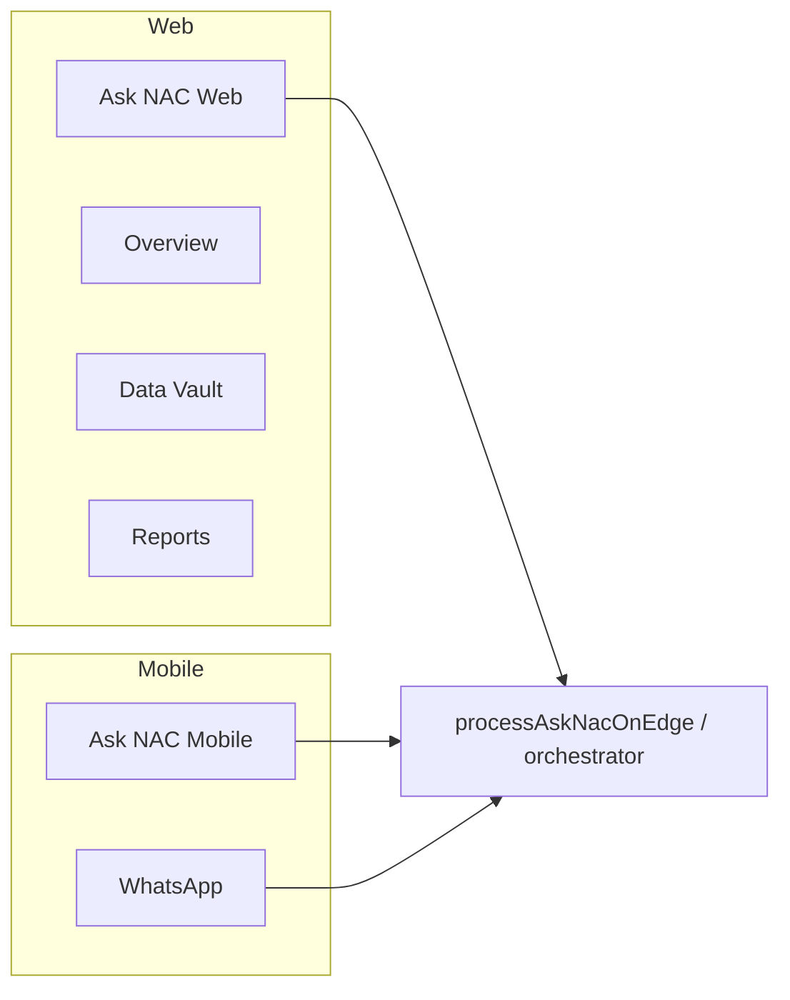

# Ask NAC Consolidation & UI Simplification Roadmap

**Status:** Architecture / planning only — no implementation in this document.  
**Strategic goal:** Users should think **“I use Ask NAC”**, not **“I use six different AI tools.”**

---

## 1. Executive summary

NAC OS has strong intelligence **engines** but fragmented **surfaces**. Ask NAC already routes 30+ intents (menu, reviews, Foodics, vault cash-up, executive analysis, NIL why-reasoning), yet the UI still exposes seven Intelligence hub tabs plus separate Reviews and Overview modules.

**Direction:**

- **Ask NAC** = primary Q&A and analytics interface (web + WhatsApp).
- **Dashboards** = live pulse, charts, and boardroom visuals that chat cannot replace.
- **Data Vault** = ingestion, coverage, and admin tooling (not chat).
- **Everything else** merges into Ask NAC capabilities or thins to upload + KPI strips.

Risk to manage is **UI complexity**, not missing functionality.

---

## 2. Current state audit

### 2.1 Primary navigation (today)

| Sidebar | Contains |
|---------|----------|
| **Overview** | `OperationalDashboard` — unified ops pulse, funnel, hourly charts |
| **Intelligence** | Hub with **7 tabs** (see below) |
| **Reviews** | Performance, Live Activity, Team, Branch Battle |
| **Menu** | Menu Manager (editor, not intelligence) |
| **Branches** | Branch metadata / scope |
| **Settings** | Platform settings |

**Intelligence hub tabs** (`src/dashboard/navigation.js`):

| Tab | Component | Primary data |
|-----|-----------|--------------|
| Ask NAC | `AskNacTab` | Edge `ask-nac`, local orchestrator |
| Command Center | `ExecutiveCommandCenter` | Executive engines, briefs, heatmaps |
| Restaurant Intelligence | `RestaurantIntelligenceHub` | Menu funnel, ops correlations |
| Sales Intelligence | `SalesIntelligenceHub` | Foodics upload, item/category KPIs |
| Menu Intelligence | `MenuIntelligence` | Menu BI charts |
| Visual OS | `VisualIntelligenceEngine` | Waiter coaching, beverage mix |
| Competitive Watch | `CompetitiveReputationWatch` | Google reputation vs competitors |

**Mobile Intelligence shell** already anticipates consolidation:

- Bottom nav: **Ask NAC** | **Dashboards** | **Vault** | **Settings**

### 2.2 Engine vs surface map

| Capability | Engine / data path | Dedicated UI | Ask NAC intents |
|------------|-------------------|----------------|-----------------|
| Sales / Foodics | `foodics/`, vault cash-up | Sales Intelligence | `sales_total`, `top_items`, `category_sales`, … |
| Menu analytics | `menu_events`, platform BI | Menu Intelligence, Overview | `menu_qr_scans`, `menu_sessions` |
| Reviews | `review_events`, Google snapshots | Reviews hub | `google_redirects`, `staff_redirect_leaderboard`, `google_reviews` |
| Operational | Platform engines, session quality | Restaurant Intelligence, Overview | `operational_knowledge`, vault ops |
| Delivery | Vault cash-up platforms, NIL | **None** (Ask NAC only) | `delivery_sales`, vault breakdown |
| NIL why | `src/intelligence/nil/` | **None** (Ask NAC only) | `vault_business_reasoning` |
| Executive | `executiveCommandCenterEngine` | Command Center | `executive_analysis`, `branch_comparison` |
| Data Vault | `vault/*`, Drive sync | `AskNacDataVaultPanel` | 12+ `vault_*` intents |
| External context | `externalContext/` (schema) | Competitive Watch (partial) | Not wired yet |
| WhatsApp | `whatsapp/` (foundation) | N/A | Future transport |

### 2.3 Module classification

| Module | Classification | Rationale |
|--------|----------------|-----------|
| **Ask NAC (chat)** | **Keep** — consolidation target | Primary interface; 30+ intents; production v44+ |
| **NIL engine** | **Keep** (no UI) | Powers deterministic why answers |
| **Data Vault panel** | **Keep** (admin) | Upload, Drive, coverage, registry — not a chat job |
| **Command Center** | **Keep** | Boardroom visual package; executive brief export |
| **Visual OS** | **Keep** | Waiter coaching charts; poor fit for chat-only |
| **Competitive Watch** | **Keep** → **Future** Ask NAC parity | Screen until external context wired |
| **Overview / Operational Dashboard** | **Keep** | Live ops pulse; 10–20s load is acceptable *if* loading UX fixed |
| **Reviews hub** | **Keep** (partial) | Live Activity + Team grids are real-time surfaces |
| **Sales Intelligence** | **Merge** | Retain Foodics import lane; move analytics Q&A to Ask NAC |
| **Menu Intelligence** | **Merge** | Optional chart strip; metrics via Ask NAC |
| **Restaurant Intelligence** | **Merge** | Narratives duplicate Ask NAC + Command Center |
| **Delivery dashboard** | **Future** | Ask NAC answers exist; dedicated screen optional later |
| **AIInsights.jsx** | **Remove** | Orphaned; not mounted |
| **PredictiveAnalytics.jsx** | **Remove** | Unmounted; predictive in Command Center |
| **External context UI** | **Future** | Schema foundation; augment NIL when wired |
| **WhatsApp ingress** | **Future** | Same orchestrator as web Ask NAC |

### 2.4 Duplicate / overlapping functionality

| Overlap | Severity | Resolution |
|---------|----------|------------|
| Sales hub KPIs vs Ask NAC Foodics intents | High | Thin Sales tab; default questions in Ask NAC |
| Menu Intelligence charts vs `menu_*` intents | High | Charts optional; chat for ad-hoc |
| Restaurant / Operations Insights narratives | Medium | Deprecate narrative cards; link to Ask NAC |
| Command Center brief vs executive Ask NAC | Medium | Same engines; CC keeps visual layout |
| Data Vault panel vs vault answers | Low (by design) | Vault = ingest; Ask NAC = consume |
| Overview hourly charts vs period Ask NAC | Low | Overview = live; Ask NAC = questions |
| Multiple debug flags (`NAC_DEBUG`, `REACT_APP_ASK_NAC_CASHUP_DEBUG`) | Medium | Unify under developer mode |

### 2.5 Orphan / legacy cleanup candidates

- `AIInsights.jsx` — not imported
- `PredictiveAnalytics.jsx` — tab alias redirects to Ask NAC
- Legacy Intelligence tab aliases (`ai`, `predictive`, `imports`, `operations`) — keep redirects through Phase 2, remove Phase 4

---

## 3. Target state

### 3.1 Proposed future sidebar (web)

Primary navigation — **five items**:

```
┌─────────────────────────────────────┐
│  Overview          ← live ops pulse │
│  Ask NAC           ← default landing  │
│  Data Vault        ← ingest & admin   │
│  Reports           ← exports & boards │
│  Settings                           │
└─────────────────────────────────────┘
```

**Reports** consolidates (not replaces engines):

- Executive Command Center (boardroom)
- Visual OS (coaching)
- Competitive Watch
- Reviews **live surfaces only** (Live Activity, Team leaderboard, Branch Battle TV mode)
- Optional pinned “saved Ask NAC answers” (future)

**Rationale vs example in brief:**

- **“Dashboard”** alone is too vague — **Overview** keeps the operational heartbeat distinct from Ask NAC.
- **Reports** is clearer than scattering Command Center / Visual OS under “Intelligence.”
- **Data Vault** stays top-level because ingestion is a different job from Q&A.
- **Menu Manager** moves under Settings or Branches (content ops, not intelligence).

**Default route after login:** `Ask NAC` for managers/executives; **Overview** for ops roles (RBAC-configurable).

### 3.2 Intelligence hub — target internal structure

Ask NAC tab becomes the hub; other tabs **move under Reports** or **thin strips**:

| Today | Target |
|-------|--------|
| 7 Intelligence tabs | 1 primary (Ask NAC) + Reports sub-nav |
| Sales Intelligence full page | Foodics import card in Vault + Ask NAC suggestions |
| Menu Intelligence full page | 3 KPI sparklines + “Ask about menu” chips |
| Restaurant Intelligence | Removed as tab; ops questions → Ask NAC |
| Command Center | Reports → Executive |
| Visual OS | Reports → Coaching |
| Competitive Watch | Reports → Competitive |

### 3.3 Ask NAC-first interaction model

Users ask; Ask NAC routes deterministically. Dedicated screens become **exceptions** for:

1. **Ingestion** (upload Foodics, vault files, Drive connect)
2. **Real-time** (live review feed, TV leaderboard)
3. **Visual/boardroom** (heatmaps, multi-chart walls, PDF layouts)
4. **Editing** (menu manager)

#### Domain → Ask NAC (primary) vs dashboard (support)

| Domain | Ask NAC (questions) | Dashboard (when still needed) |
|--------|---------------------|-------------------------------|
| **Sales** | “sales last 14 days”, “compare June vs May”, “top items”, Foodics totals | Overview sparkline; Foodics import status in Vault |
| **Menu** | “menu qr scans”, “sessions”, category friction | Overview funnel; Menu Manager for edits |
| **Reviews** | “google redirects”, “staff leaderboard”, review counts | Live Activity feed; Team grid |
| **Operational** | vault cash-up, logbook, reception summaries | Overview trust badges; partial data banners |
| **Delivery** | “delivery mix”, platform breakdown, why delivery down | None required initially |
| **NIL reasoning** | all “why …” questions | None — chat-only |
| **Executive** | “executive brief”, branch comparison | Command Center layout + PDF export |

**Citation rule (unchanged):** every answer cites source, branch, period, freshness when available.

---

## 4. Clean UI principles (ChatGPT-like Ask NAC)

### 4.1 User-facing (default mode)

**Show:**

- Answer prose (NIL sections when applicable)
- Key metrics cards
- Charts when answer includes chart-worthy series (future: inline mini charts)
- Export actions (PDF, executive brief) when `exportOptions` present
- Sources, warnings, missing-data callouts
- Trust label (deterministic / AI-narrated — increasingly “deterministic only” for analytics)

**Hide:**

- Intent / route names (`vault_cash_up_summary`)
- Tool names (`runVaultQueryTool`, `buildVaultAnswer`)
- Orchestration metadata (`routingDebug`, `routingConfidence` raw JSON)
- `cashUpProductionTrace`, pipeline steps, PostgREST equivalents
- Edge version, serverConnected flags
- OpenAI / `aiConnected` unless answer is explicitly AI-narrated (analytics path: never)

### 4.2 Message layout standard

```
┌──────────────────────────────────────────┐
│ Title (human period + branch)            │
│ ─────────────────────────────────────── │
│ Direct answer (sections for NIL)         │
│ Key metrics (compact grid)               │
│ [Export PDF]  [Copy]                     │
│ Sources · Warnings (collapsed)           │
└──────────────────────────────────────────┘
```

No “Intent: vault_business_reasoning” in default UI.

### 4.3 Developer mode standards

**Single gate** (replace fragmented flags):

| Gate | Effect |
|------|--------|
| RBAC role `developer` OR `window.NAC_DEBUG = true` OR user pref `developerMode` (future) | Reveal diagnostics |

**Developer mode reveals:**

- Routed intent + confidence
- `routingDebug.topMatches`
- `cashUpProductionTrace` / `cashUpDebug`
- Readiness object
- Edge `serverConnected`, `aiConnected`
- Raw JSON `<details>` on each message

**Production default:** `REACT_APP_ASK_NAC_CASHUP_DEBUG` deprecated in favor of unified developer mode.

**WhatsApp:** per-user `developer_mode` on `whatsapp_users` — same semantics; never default on.

---

## 5. Loading-state philosophy

### 5.1 Problems today

- Stale metrics remain visible while filters change (Overview 10–20s loads)
- Insufficient loading feedback on Intelligence hub tab switches
- Ask NAC chat keeps prior messages visible (good) but no skeleton for in-flight answer
- Partial/trust states exist (`IntelligenceDataStatus`, `PlatformStatusBanner`) but inconsistently applied

### 5.2 Standards (target)

| Surface | Loading pattern | Stale-data rule |
|---------|-----------------|-----------------|
| **Ask NAC** | Composer `aria-busy`; skeleton assistant bubble while waiting; disable send | Show prior turns; never mix old answer with new question |
| **Overview** | Full-panel skeleton on filter change; shimmer on metric tiles | **Clear metrics** when branch/range changes until new fetch completes |
| **Reports / charts** | Chart skeleton (`nac-bi-skeleton`); preserve layout height | Dim + “Updating…” banner if refresh > 300ms |
| **Vault panel** | Section spinners; Drive sync progress | Show last coverage with stale badge |
| **Mobile** | Same rules; prefer skeleton over blank |

### 5.3 Cache strategy principles

1. **Branch + range + shift** form cache key — invalidate all visible metrics on change.
2. **Optimistic UI** only for non-critical labels (tab highlight), never for revenue/guest counts.
3. **Platform status contract** (`healthy`, `partial`, `live_fallback`, `stale_rollup`) drives banner copy — one component, all modules.
4. **Ask NAC** does not client-cache answers across branch changes without re-fetch.
5. **SWR-style stale-while-revalidate** allowed for Overview *only* with explicit “Updating…” overlay.

### 5.4 Acceptance criteria (UX)

- Filter change → previous numbers hidden or greyed within 100ms
- Skeleton visible within 200ms on slow paths
- No silent 15s wait without progress indicator
- Trust badge explains partial data (existing pattern — extend uniformly)

---

## 6. Mobile & WhatsApp relationship



| Capability | Web | WhatsApp | Dashboard |
|------------|-----|----------|-----------|
| Free-text analytics | ✅ Primary | ✅ Primary | ❌ |
| NIL why reasoning | ✅ | ✅ | ❌ |
| Cash-up / period queries | ✅ | ✅ | ❌ |
| PDF / executive export | ✅ | Future attach | Command Center |
| Foodics / file upload | ✅ Vault | ❌ | ❌ |
| Drive connect / registry admin | ✅ Vault | ❌ | ❌ |
| Live review feed | ✅ Reviews | ❌ | ✅ Real-time |
| TV leaderboard | ✅ | ❌ | ✅ |
| Multi-chart boardroom | ✅ Reports | ❌ | ✅ |
| Menu editing | ✅ Menu Manager | ❌ | ❌ |
| Developer traces | ✅ dev mode | ❌ | ❌ |

**WhatsApp is transport**, not a second product — same intents, same NIL sections, formatted for mobile (`formatAskNacAnswerForWhatsApp`).

---

## 7. Migration strategy

### Phase 0 — Foundation (done / in progress)

- [x] Ask NAC Edge parity (cash-up, periods, NIL why)
- [x] Production verifiers (`cash-up-flexible-period-prod-verify.mjs`, `nil-why-prod-verify.mjs`)
- [x] WhatsApp + external context **architecture** docs
- [x] Mobile shell prototype (`IntelligenceMobileShell`)

### Phase 1 — UX hygiene (no nav restructure)

- Unified developer mode (replace `REACT_APP_ASK_NAC_CASHUP_DEBUG`)
- Hide intent/tool/debug in default Ask NAC answer cards
- Overview stale-data prevention on filter change
- Ask NAC in-flight skeleton bubble
- Remove orphaned `AIInsights.jsx`, unmounted `PredictiveAnalytics.jsx`

**Risk:** Low. No route changes.

### Phase 2 — Thin legacy tabs

- Sales Intelligence → import strip + Ask NAC suggestion chips (already partially there)
- Menu Intelligence → 3 KPIs + “Ask NAC” CTA
- Restaurant Intelligence tab → redirect to Ask NAC with ops prompt templates
- Document “question ownership” in user-facing help

**Risk:** Medium — user habit on tab names.

### Phase 3 — Navigation consolidation

- Introduce sidebar: Overview | Ask NAC | Data Vault | Reports | Settings
- Move Command Center, Visual OS, Competitive under Reports
- Default landing → Ask NAC (role-based override)
- Keep legacy tab aliases / deep links 90 days

**Risk:** Medium — training, bookmarks.

### Phase 4 — Deep merge

- External context wired → Competitive Watch data in Ask NAC answers
- Saved / pinned Ask NAC reports
- Optional Delivery report under Reports (only if charts needed)
- Retire Sales/Menu/Restaurant Intelligence tab components

**Risk:** Low if Phase 2–3 complete.

### Phase 5 — WhatsApp & executive mobile

- `whatsapp-webhook` Edge function
- Executive mobile: Ask NAC + Overview only; Reports read-only where needed

---

## 8. Biggest simplification opportunities

| Opportunity | Impact | Effort |
|-------------|--------|--------|
| **Collapse 7 Intelligence tabs → Ask NAC + Reports** | Very high — removes “six AI tools” feeling | Medium (nav + redirects) |
| **Retire Sales/Menu/Restaurant full pages** | High — duplicate KPIs | Low–medium (thin strips) |
| **Remove debug/intent from default Ask NAC UI** | High — ChatGPT-like clarity | Low |
| **Overview stale-data fix** | High — trust on 10–20s loads | Medium |
| **Single developer mode** | Medium — less flag sprawl | Low |
| **Delete AIInsights + PredictiveAnalytics orphans** | Low–medium — codebase clarity | Trivial |
| **Centralize platform status banners** | Medium — consistent partial-data UX | Low |
| **WhatsApp as third client of same orchestrator** | High strategic — one brain | Medium (webhook) |

---

## 9. What not to consolidate

Preserve standalone surfaces for:

- **Upload workflows** (Foodics CSV, vault files, bulk import)
- **Real-time feeds** (live review activity)
- **Boardroom visuals** (Command Center heatmaps, Visual OS coaching grids)
- **Content editing** (Menu Manager)
- **RBAC admin** (Settings, branch scope)

Ask NAC should **consume** ingested data, not replace ingestion UI.

---

## 10. Verification & governance

After each phase:

| Check | Tool |
|-------|------|
| Ask NAC regressions | `nil-why-prod-verify.mjs`, `cash-up-flexible-period-prod-verify.mjs` |
| Intent routing | `npm test` — NLU + edge routing tests |
| No fake data | Workspace rule — cite source/branch/period |
| Branch isolation | RBAC tests + manual JWT matrix |

Do not remove a dedicated screen until Ask NAC parity is documented for its core questions.

---

## 11. Related documents

| Doc | Relevance |
|-----|-----------|
| `docs/NAC_OS_ARCHITECTURE.md` | Platform engines, status contract |
| `docs/architecture/whatsapp-ask-nac-architecture.md` | WhatsApp transport |
| `docs/architecture/external-context-intelligence.md` | Competitive/external NIL |
| `src/dashboard/navigation.js` | Current nav source of truth |
| `tmp-vault-verify/nil-why-prod-verify.mjs` | Post-deploy NIL check |

---

## 12. Success metrics (qualitative)

- Managers describe product as **“Ask NAC”** in training materials
- Intelligence hub tab count: **7 → 1 primary** (+ Reports sub-nav)
- Default Ask NAC answer cards show **zero** routing metadata
- Overview filter change never shows **previous branch numbers** without stale indicator
- WhatsApp and web return **same intent** for equivalent questions (verified by shared prod scripts)

---

*Architecture only — no UI changes, deployments, or migrations are implied by this document.*
