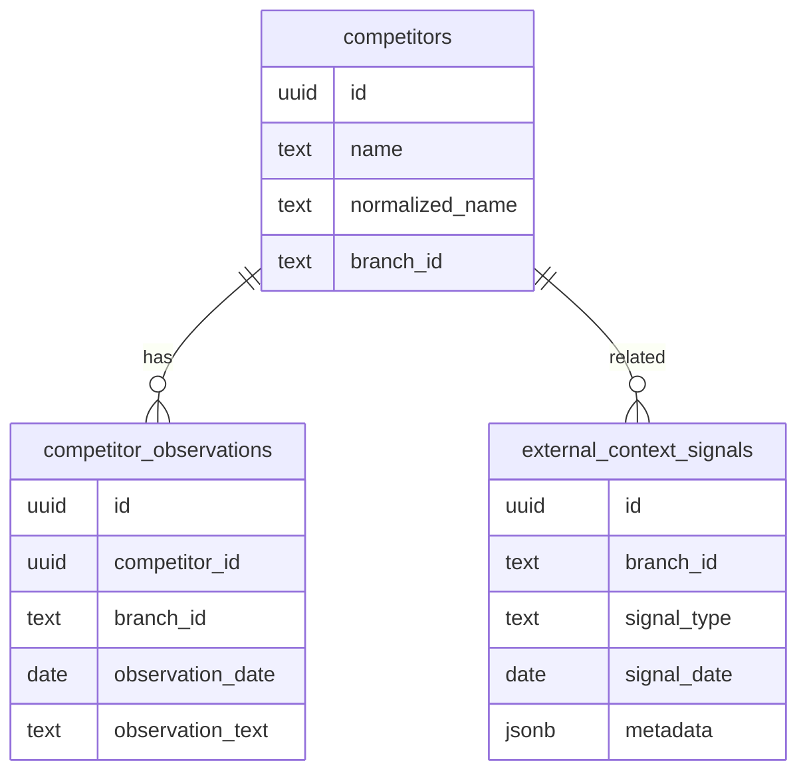

# External Context Intelligence — Architecture Foundation

**Status:** Schema + contracts + NIL adapter foundation. No live weather/news/event API collectors. No production Ask NAC wiring yet.

**Purpose:** When Ask NAC answers “Why were sales down?”, external context (weather, competitors, mall events, holidays) supplements internal cash-up signals **without inventing causality**.

---

## 1. Core principle

External context **augments** NIL reasoning; it never replaces internal facts.

| Allowed | Not allowed |
|---------|-------------|
| “Humidity was unusually high and **may have reduced** walk-in traffic.” | “Sales dropped **because** humidity was high.” |
| “House of Agapi **appeared busier** (manager observation).” | “Competitors **caused** the decline.” |
| Correlation + hypothesis with confidence | Definitive causal claims without evidence |

When no rows exist for a period, answers continue to show:

> No external context sources are connected yet.

---

## 2. Schema overview



### Tables

| Table | Role |
|-------|------|
| `competitors` | Configurable registry (not hardcoded in NIL) |
| `external_context_signals` | Universal external signal store |
| `competitor_observations` | Manual/imported competitor activity notes |

**Migration:** `supabase/migrations/20260621180000_external_context_and_whatsapp_foundation.sql`

**RLS (hardened):** See §2.1. `authenticated` has **SELECT only**; writes are service-role / Edge until explicitly re-audited.

### 2.1 RLS rules (staging/production)

| Resource | Read | Write (defense-in-depth) |
|----------|------|---------------------------|
| `competitors` | Cross-branch roles: all. Branch users: own `branch_id` only. **`branch_id IS NULL` = admin/cross-branch only** | Admin only (`ask_nac_vault_is_admin`) |
| `external_context_signals` | Cross-branch: all. **`applies_to_all_branches=true`**: any user with branch access. Branch rows: `ask_nac_vault_branch_allowed(branch_id)` | `ask_nac_external_context_can_write()` — branch users cannot create network rows |
| `competitor_observations` | Branch + `sensitivity_level` via `ask_nac_vault_can_read_sensitivity` (`confidential` → `management`) | Branch-scoped write; confidential limited for branch-only roles |

**Signal scope CHECK (no silent invisible holidays):**

- **Network signal:** `applies_to_all_branches = true` AND `branch_id IS NULL` (use for macro, public_holiday, national events).
- **Branch signal:** `branch_id` set AND `applies_to_all_branches = false`.

**SQL helpers:** `ask_nac_has_any_branch_access`, `ask_nac_external_context_branch_allowed`, `ask_nac_external_context_can_write`, `ask_nac_competitors_can_read`, `ask_nac_competitor_observation_can_read/write`.

**JS mirror (tests):** `src/intelligence/externalContext/externalContextRlsContract.js`

**Writes today:** No `GRANT INSERT/UPDATE/DELETE` to `authenticated`. Collectors must use service role with explicit branch scoping in application code.

---

## 3. Signal types

| `signal_type` | NIL domain | Bundle key |
|---------------|------------|------------|
| `weather` | weather | `weatherSignals` |
| `competitor` | competitive | `competitorSignals` |
| `mall_event`, `local_event`, `traffic`, `road_closure` | location | `locationSignals` |
| `public_holiday`, `school_calendar` | calendar | `calendarSignals` |
| `news`, `tourism`, `macro` | macroeconomic | `macroSignals` |
| `manual_observation` | competitive (default) | `competitorSignals` |

Defined in `src/intelligence/externalContext/externalContextContract.js`.

---

## 4. Competitor registry

**Khobar seed names** (registry rows only — reasoning loads from DB):

- HOUSE OF AGAPI
- San Carlo Cicchetti
- Café Lilou
- Urth Caffé
- Patio Mall restaurants / concepts

Helpers: `normalizeCompetitorName()`, `filterActiveCompetitorsForBranch()`.

**Never** embed competitor names in `businessReasoningEngine` logic; engine consumes **signals** produced by adapters.

---

## 5. Weather metadata example

Stored in `external_context_signals.metadata`:

```json
{
  "temperature_c": 42,
  "humidity_pct": 75,
  "heat_index_c": 48,
  "wind_kph": 18,
  "condition": "humid",
  "outdoor_comfort_score": "poor"
}
```

Adapter maps to NIL correlation-level signals with `source_reliability` from API or manual entry.

---

## 6. Calendar / event coverage

Supported via `signal_type` + metadata:

- Ramadan, Eid, Saudi National Day
- School / university exams and holidays
- Summer vacation
- Football matches, mall activations, concerts, exhibitions
- Long weekends

Use `signal_subtype` for fine classification (e.g. `subtype: "ramadan"`, `"football_screening"`).

---

## 7. NIL integration

### Adapter

`src/intelligence/externalContext/adapters/externalContextSignalAdapter.js`

```javascript
const externalBundle = adaptExternalContextToNilBundle({
  externalSignals,      // rows from external_context_signals
  competitorObservations,
  competitors,
  period: { startDate, endDate },
  branchLabel: "Khobar",
  periodLabel: "last 7 days vs previous 7 days",
});

const nilInput = mergeNilSignalBundles(internalBundle, externalBundle);

businessReasoningEngine({
  question,
  branchLabel,
  periodLabel,
  ...nilInput,
});
```

### Output bundles

- `weatherSignals`
- `competitorSignals`
- `calendarSignals`
- `locationSignals`
- `macroSignals`

Each signal includes:

- Source attribution (`source_name`, `source_type`)
- Reliability / confidence
- Impact direction
- Impacted metrics (when known)
- Time window overlap score

---

## 8. Future Ask NAC query flow

```
User: "Why were sales down yesterday?"
  ↓
resolveWhyVaultCompare() / period parser
  ↓
getVaultCashUpFactsOverRange() → internalSignals
  ↓
SELECT external_context_signals WHERE branch + date overlap
SELECT competitor_observations WHERE branch + date overlap
  ↓
adaptExternalContextToNilBundle()
  ↓
businessReasoningEngine() → facts / correlations / hypotheses / recommendations
  ↓
append External Context section + source labels
```

**Not wired in this phase** — `vaultBusinessReasoningAnswer` still sets `externalContextConnected: false`.

---

## 9. Confidence model

| Level | Criteria |
|-------|----------|
| **High** | Multiple sources agree; high `source_reliability`; exact date overlap; internal metrics align |
| **Medium** | One reliable signal; good overlap; partial metric alignment |
| **Low** | Manual observation only; vague timing; weak alignment |

Implemented in adapter via `scoreSignalPeriodOverlap()` + row `confidence` / `source_reliability`.

Overall reasoning confidence still computed by `scoreOverallReasoningConfidence()` in NIL.

---

## 10. Safety / truthfulness rules

1. External rows adapt to **correlation** evidence level by default.
2. Adapter appends cautious phrasing (“may have contributed”).
3. `FORBIDDEN_CAUSALITY_PATTERNS` tested in contract tests.
4. Hypotheses require internal facts; weather/competitor alone do not auto-generate definitive hypotheses in engine without internal alignment.
5. Missing external data → unchanged unavailable note (no fake weather/news).
6. Branch scoping enforced at SQL (RLS) and query time.

---

## 11. Code foundation

| Path | Purpose |
|------|---------|
| `externalContextContract.js` | Types, validation, domain mapping |
| `competitorRegistry.js` | Normalization, seed name constants |
| `adapters/externalContextSignalAdapter.js` | DB rows → NIL bundles |
| `externalContextRlsContract.js` | RLS semantics mirror for tests |
| `index.js` | Public exports |

---

## 12. Future API integration roadmap

| Phase | Work |
|-------|------|
| **P0 (done)** | Migration, contracts, adapter, docs |
| **P1** | Supabase fetch helpers in vault query tools (read-only) |
| **P2** | Weather API collector Edge cron → `external_context_signals` |
| **P3** | Competitor observation UI / manager mobile capture |
| **P4** | Wire adapter in `buildVaultBusinessReasoningAnswer` when rows exist |
| **P5** | Calendar/holiday import (ICS / manual admin) |
| **P6** | Flip `externalContextConnected: true` in diagnostics when live |

---

## 13. Tests

`src/intelligence/externalContext/externalContextFoundation.test.js`

- Competitor normalization
- Signal row validation
- Adapter → NIL bundle shape
- Confidence / overlap mapping
- RLS policy contract (Khobar/Riyadh manager, CEO scopes)
- Forbidden causality language guard
- Branch filter helpers

Run: `npm test -- --watchAll=false`

---

## 15. Production apply checklist

1. Apply migration on **staging** only first.
2. Run JWT role matrix against live RLS (Khobar GM, Riyadh GM, staff, CEO) — see `externalContextFoundation.test.js` contract scopes.
3. Confirm `\dp` / grants: **no authenticated INSERT** on external context tables.
4. Ingest test rows: branch-scoped weather + one `applies_to_all_branches` holiday; verify read isolation.
5. Do **not** wire Ask NAC fetch until step 4 passes.
6. Plan `whatsapp_message_logs` retention before webhook (PII).

---

## 14. What is **not** live after this phase

- No API calls to weather/news providers
- No Ask NAC answer changes in production Edge
- No automatic competitor observations
- Migration **not** applied to production (local/staging apply only)
