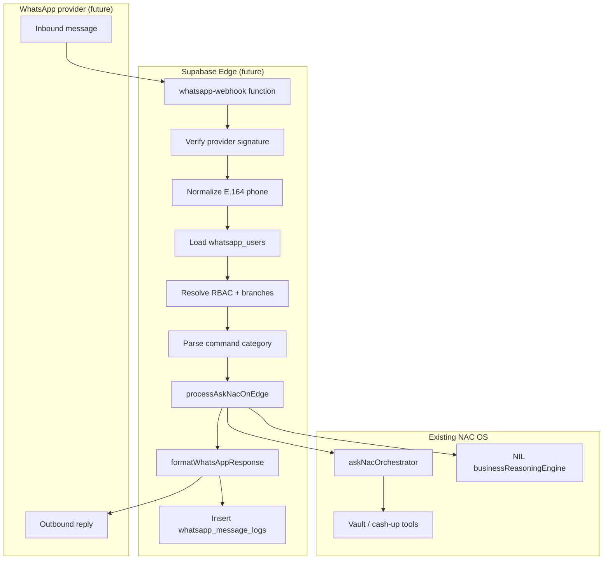

# WhatsApp → Ask NAC Architecture Foundation

**Status:** Foundation only — schema contracts and integration design documented here. No live webhook, no provider integration, no deployment in this phase.

**Goal:** Route approved WhatsApp users into the same Ask NAC intelligence path used by the web app, with branch RBAC, NIL-formatted answers, and audit logging.

---

## 1. Architecture overview



**Principles**

- WhatsApp is a **transport layer**, not a separate intelligence stack.
- All analytics flow through **Ask NAC** (`processAskNacOnEdge` / app-side orchestrator).
- **Branch isolation** reuses `ask_nac_vault_branch_allowed`, `ask_nac_user_branch_access`, and `ask_nac_staff` — WhatsApp does not invent a parallel permission system.
- **Debug traces** (`cashUpProductionTrace`, routing debug) stay server-side; WhatsApp responses never include them unless developer mode is explicitly enabled for that user (future flag).

---

## 2. Identity model

### Table: `whatsapp_users`

| Column | Type | Notes |
|--------|------|--------|
| `id` | uuid PK | |
| `phone_number_e164` | text UNIQUE | Must match `^\+[1-9]\d{1,14}$` |
| `display_name` | text | Optional friendly name |
| `linked_user_id` | uuid nullable | Future link to `auth.users.id` |
| `linked_email` | text nullable | Maps to `ask_nac_staff.email` when auth user not linked |
| `vault_role` | text | Reuses `ask_nac_roles.code` (not a isolated role enum) |
| `primary_branch_id` | text nullable | khobar \| riyadh \| jeddah |
| `allowed_branch_ids` | text[] | Explicit grants; empty + cross_branch role = all branches |
| `is_active` | boolean | Soft disable without delete |
| `is_admin` | boolean | Can manage WhatsApp allowlist (future admin UI) |
| `can_request_exports` | boolean | PDF/CSV export commands |
| `can_receive_push_alerts` | boolean | Scheduled pushes / alert subscriptions |
| `preferred_language` | text | Default `en`; future `ar` |
| `developer_mode` | boolean | Optional exposure of debug fields (default false) |
| `created_at` | timestamptz | |
| `updated_at` | timestamptz | |
| `last_seen_at` | timestamptz nullable | Last inbound message |

**E.164 normalization:** strip spaces/dashes, ensure leading `+`, reject invalid lengths. Implemented in `src/intelligence/whatsapp/whatsappContract.js` → `normalizePhoneE164()`.

**Schema constraints (migration):**

- `allowed_branch_ids` must be subset of `{khobar, riyadh, jeddah}` (SQL CHECK).
- `linked_user_id` → `auth.users(id)` optional FK; **does not grant access by itself**.
- `linked_email` stored lower-case.
- `is_admin` on `whatsapp_users` is **not** used for RLS; webhook must call vault RBAC helpers.

**RBAC derivation (required at webhook):**

1. Load `whatsapp_users` by E.164 (allowlist).
2. Resolve `linked_email` → `ask_nac_staff` + `ask_nac_user_branch_access`.
3. Enforce `ask_nac_vault_branch_allowed(resolved_branch)` before `processAskNacOnEdge`.
4. Treat `whatsapp_users.vault_role` as hint only — authoritative source is vault staff matrix.

**Multi-branch executives:** `vault_role` with `cross_branch = true` in `ask_nac_roles` (ceo, super_admin, ops_manager) + `allowed_branch_ids` empty or explicit list.

**Branch managers:** `primary_branch_id` set; `allowed_branch_ids` typically `[primary_branch_id]`.

---

## 3. Permission model (WhatsApp RBAC)

WhatsApp permissions **derive from existing vault roles**, not a standalone matrix.

| Persona | Vault role (examples) | Branches | Analytics | Exports | Alerts |
|---------|----------------------|----------|-----------|---------|--------|
| Developer / CEO / COO | `super_admin`, `ceo` | All | All intents | Yes | Yes |
| GM | `branch_manager` | Own branch | Cash-up, delivery, why | If `can_request_exports` | If enabled |
| Assistant manager | `ops_manager` | Assigned via `ask_nac_user_branch_access` | Read analytics | Limited | Optional |
| Reception / staff | `reception_manager`, `staff` | Own branch | **Future:** help + limited commands only | No | No |

**Enforcement points**

1. `whatsapp_users.is_active = true`
2. Phone must exist in allowlist (`whatsapp_users`)
3. Resolved `branch_id` must pass `ask_nac_vault_branch_allowed(branch_id)` for the linked email/role
4. Export commands require `can_request_exports`
5. Alert subscription requires `can_receive_push_alerts`

**Denied requests** return a short WhatsApp message (no internal error codes) and log `denial_reason` in `whatsapp_message_logs`.

---

## 4. Message flow (runtime — future)

```
WhatsApp provider
  ↓ POST /functions/v1/whatsapp-webhook
Verify provider signature (Meta / Twilio / etc.)
  ↓
Normalize phone → E.164
  ↓
SELECT whatsapp_users WHERE phone_number_e164 = ? AND is_active
  ↓ (miss → polite deny + log)
Resolve linked_email → ask_nac_staff + ask_nac_user_branch_access
  ↓
classifyWhatsAppMessage(text) → category + normalized question
  ↓
resolveWhatsAppBranch(text, user) → branch_id | clarification | deny
  ↓
processAskNacOnEdge(supabase, { question, branch, filters: { branch } })
  ↓
formatAskNacAnswerForWhatsApp(answer, { developerMode })
  ↓
Provider send API + INSERT whatsapp_message_logs
```

**Service role:** Webhook handler uses Supabase service role server-side only. Never expose service role to clients or WhatsApp payloads.

---

## 5. Command interpretation

Categories (`WHATSAPP_MESSAGE_CATEGORIES` in contract):

| Category | Examples | Routes to |
|----------|----------|-----------|
| `ask_nac_free_text` | "why were sales down last 7 days" | Ask NAC intent router |
| `branch_question` | "Khobar sales today" | Ask NAC + resolved branch |
| `report_request` | "send weekly report" | Future export pipeline |
| `export_request` | "PDF executive brief" | Export if permitted |
| `daily_brief` | "daily brief" | Scheduled/snapshot brief |
| `alert_subscription` | "subscribe low sales alerts" | Future alerts table |
| `help` | "help" | Static command list |

**Classifier:** `classifyWhatsAppMessage()` in `whatsappContract.js` — keyword/heuristic foundation; can be replaced by NLU later without changing downstream flow.

---

## 6. Branch resolution

Rules (`resolveWhatsAppBranch()` in `whatsappBranchResolver.js`):

| Scenario | Behavior |
|----------|----------|
| User has exactly one allowed branch | Default to that branch |
| Multiple branches, branch mentioned in text | Use mentioned branch if authorized |
| Multiple branches, no branch in text | Return `needs_clarification` with branch list |
| Unauthorized branch requested | `denied` with polite message |
| Executive / cross_branch role | Allow network or per-branch queries |
| Compare across branches | Allowed only if role permits **each** branch |

Branch aliases reuse Ask NAC patterns: khobar, riyadh, jeddah (+ al khobar, jedda, etc.).

---

## 7. Response formatting (WhatsApp-friendly)

Rules:

- Concise, mobile-readable
- No JSON blobs, no `routingDebug`, no tool names
- Preserve NIL sections when present
- Short metric blocks for cash-up answers
- Future: `reply MORE` for truncated long answers

**Example — why question**

```
NAC OS — Khobar
Why were sales down last 7 days?

Confirmed Facts
• Sales declined 14.2%
• Guests declined 12.1%
• Average spend remained stable

Evidence-Based Correlations
• Guest decline aligned with sales decline

Hypotheses
• Lower guest traffic may indicate a possible contributor

Recommendations
• Review same-period operational notes

Confidence: Medium

External Context
• No external context sources are connected yet.
```

**Example — latest cash up**

```
NAC OS — Khobar
Latest Cash-Up — 19 Jun 2026

Net Sales: SAR 42,180
Guests: 412
Orders: 398
Average Spend: SAR 102.38
Delivery Sales: SAR 8,240

Source: Uploaded cash-up · Khobar
```

Implementation: `formatAskNacAnswerForWhatsApp()` in `whatsappResponseFormatter.js`.

---

## 8. Future media support (design only)

| Capability | Notes |
|------------|--------|
| PDF send | Executive brief export; requires `can_request_exports` |
| CSV send | Tabular metrics; size limits |
| Chart snapshot | Rendered PNG from dashboard engine |
| Voice note in | Transcribe → treat as free-text question |
| Voice reply | TTS summary (optional, low priority) |
| Daily scheduled push | Cron + `can_receive_push_alerts` |
| Alert push | Threshold rules on sales/guests/delivery |

---

## 9. Security model

| Control | Implementation |
|---------|----------------|
| Provider signature validation | HMAC / Meta verify token at webhook |
| Phone allowlist | `whatsapp_users` only |
| Inactive user denial | `is_active = false` |
| Branch RBAC | `ask_nac_vault_branch_allowed` |
| Audit logging | `whatsapp_message_logs` every inbound |
| Rate limiting | Per-phone sliding window at webhook (future) |
| No secrets in frontend | Webhook secrets in Supabase Edge env only |
| No service role to client | Webhook Edge function only |
| Export gate | `can_request_exports` |
| Cross-branch leakage | Deny + log if branch not in allowed set |
| Webhook RBAC | **Must re-resolve `ask_nac_staff` / `ask_nac_vault_branch_allowed` — do not trust `whatsapp_users.vault_role` or `is_admin` alone** |
| Message log PII | `inbound_message` + phone retained indefinitely until retention policy added |

---

## 10. Audit logging

### Table: `whatsapp_message_logs`

| Column | Purpose |
|--------|---------|
| `whatsapp_user_id` | FK to allowlist row |
| `phone_number_e164` | Denormalized for audit |
| `inbound_message` | Raw text |
| `normalized_question` | After classification |
| `resolved_intent` | Ask NAC intent if reached |
| `branch_id` | Resolved scope |
| `allowed` | boolean |
| `denial_reason` | Short code/message |
| `response_summary` | First ~500 chars of outbound |
| `response_type` | nil_why \| cash_up \| help \| denied \| error |
| `latency_ms` | End-to-end |
| `provider_message_id` | Idempotency / trace |
| `created_at` | |

**RLS:** Admin read (`ask_nac_vault_is_admin()`); inserts via service role from webhook only.

---

## 11. Code foundation (this repo)

| Path | Purpose |
|------|---------|
| `src/intelligence/whatsapp/whatsappContract.js` | E.164, categories, role constants |
| `src/intelligence/whatsapp/whatsappBranchResolver.js` | Branch default/clarify/deny |
| `src/intelligence/whatsapp/whatsappResponseFormatter.js` | Ask NAC → WhatsApp text |
| `src/intelligence/whatsapp/index.js` | Public exports |
| `supabase/migrations/…_external_context_and_whatsapp_foundation.sql` | `whatsapp_users`, `whatsapp_message_logs` DDL |

**Not implemented yet:** `supabase/functions/whatsapp-webhook/`, provider SDK, live sends.

---

## 12. Implementation roadmap

| Phase | Deliverable |
|-------|-------------|
| **P0 (done)** | Schema, contracts, docs, formatters |
| **P1** | `whatsapp-webhook` Edge function, Meta/Twilio adapter, signature verify |
| **P2** | Link `whatsapp_users.linked_user_id`, admin UI for allowlist |
| **P3** | PDF/CSV outbound, export permission enforcement |
| **P4** | Alert subscriptions + scheduled daily brief push |
| **P5** | Voice note transcription |

---

## 13. Integration with Ask NAC

```javascript
// Future webhook handler (pseudocode)
const user = await loadWhatsAppUser(phoneE164);
const branch = resolveWhatsAppBranch(message, user);
if (branch.status === "denied") return formatDenial(branch.reason);

const answer = await processAskNacOnEdge(supabase, {
  question: branch.normalizedQuestion,
  branch: branch.branchId,
  filters: { branch: branch.branchId },
  profileHint: { email: user.linked_email, vaultRole: user.vault_role },
});

return formatAskNacAnswerForWhatsApp(answer, { developerMode: user.developer_mode });
```

Existing production behavior (cash-up, comparisons, NIL why) remains unchanged; WhatsApp adds a new ingress only.
